Table of Contents
- [Introduction](#introduction)
  - [Tools](#tools)
- [Shift Register (sreg)](#shift-register-sreg)
  - [SystemVerilog](#systemverilog)
    - [Simulation Wave Diagrams](#simulation-wave-diagrams)
    - [Elaborated Schematics](#elaborated-schematics)
      - [Yosys](#yosys)
      - [Vivado](#vivado)
    - [Synthesized Schematic](#synthesized-schematic)
  - [VHDL](#vhdl)
    - [QuestaSim Wave Diagram](#questasim-wave-diagram)
    - [Elaborated Schematic](#elaborated-schematic)
    - [Synthesized Schematic](#synthesized-schematic-1)
- [Multiplexer (mux)](#multiplexer-mux)
  - [SystemVerilog](#systemverilog-1)
    - [Simulation Wave Diagrams](#simulation-wave-diagrams-1)
    - [Elaborated Schematics](#elaborated-schematics-1)
      - [Yosys](#yosys-1)
      - [Vivado](#vivado-1)
    - [Synthesized Schematic](#synthesized-schematic-2)
  - [VHDL](#vhdl-1)
    - [Simulation Wave Diagram](#simulation-wave-diagram)
    - [Elaborated Schematic](#elaborated-schematic-1)
    - [Synthesized Schematic](#synthesized-schematic-3)

# Introduction

You have many RTL files and have corresponding testbenches. When you want to verify them it can get quite tedious to create projects for each of them. Is there a quick way to make evaluation or review much faster without the overhead of creating projects? 

Yes there is.

I made a multi-language, multi-platform Makefile-based system to accelerate HDL design work flow.  This is a fast and scalable system where new targets can be seamlessly added for further analysis with other tools. Evaluation includes generating wave diagrams, elaborated and synthesized schematics in both SystemVerilog and VHDL. With Makefile and Linux environment you can execute different targets in different shells (license permitting) in the same working directory. 

In this example a marshalling component (parallelizer) is presented using both shift register (sreg) and multiplexer (mux) architectures in SystemVerilog (SV) and VHDL. 

## Tools

* Verilator
* QuestaSim
* Vivado
* Yosys
* netlistsvg
* sv2v
* Gtkwave
* WSL Ubuntu in Windows 11
* VS Code

# Shift Register (sreg)

A byte marshalling shift register is created in SV and VHDL. Serial bits are sent to the module and after 8 clock cycles, a byte is output in an 8 bit bus. The testbench tests this module with a 32 bit word in hex "ABCD1234". In the output we see "34", "12", "CD" and "AB". 

## SystemVerilog 

### Simulation Wave Diagrams
<table>
  <tr>
    <td align="center">
      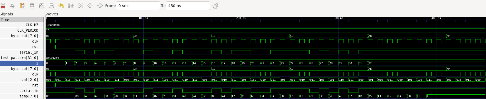 
      <small>Figure 1: Verilator wave diagram output in Gtkwave done in SV</small>
    </td>
  </tr>
  <tr>
    <td align="center">
      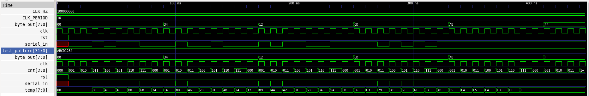 
      <small>Figure 2: QuestaSim compiled output shown in Gtkwave done in SV</small>
    </td>
  </tr>
</table>

Since verilator cannot handle 4-state representation it does not show 'X' values for _serial_in_ input while the QuestaSim figure does. Verilator only has function for 2-state representation.

### Elaborated Schematics

#### Yosys

The open-source synthesis tool, part of OSS-CAD-Suite is used to generate an elaborated circuit on the HDL files. 

  <figure>
    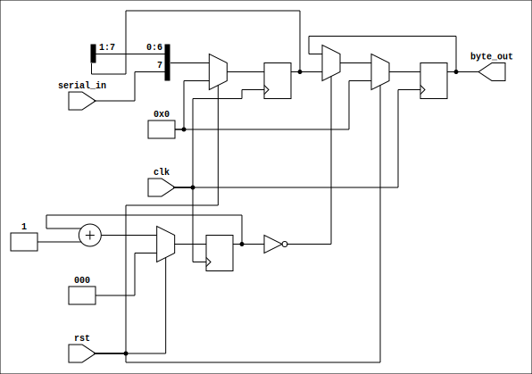
    <figcaption>Figure 3: The elaborated Yosys schematic for shift register architecture</figcaption>
  </figure>

#### Vivado

In this representation, Vivado 2023.2 was used as a Makefile target to generate an SVG file for the elaborated circuit using Tcl files. 

  <figure>
    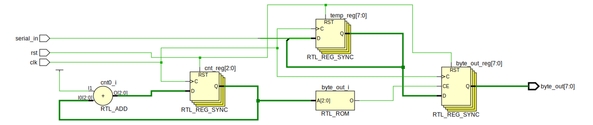
    <figcaption>Figure 4: The elaborated schematic generated by Vivado for shift register architecture</figcaption>
  </figure>

### Synthesized Schematic

  <figure>
    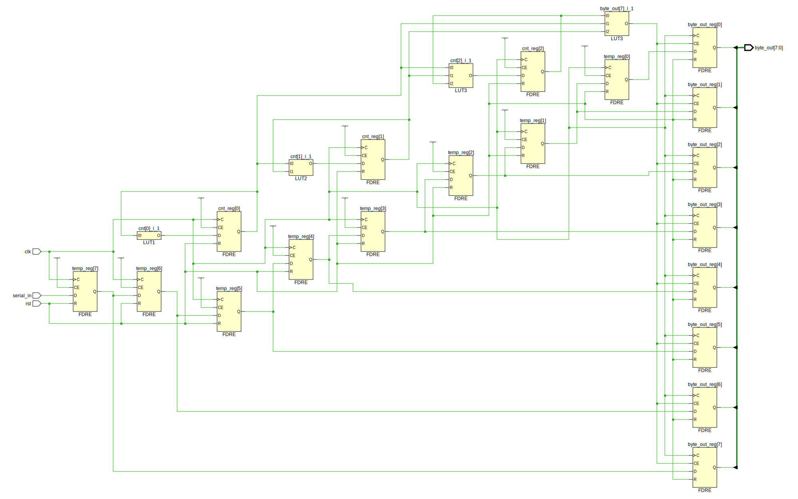
    <figcaption>Figure 5: The synthesized schematic generated by Vivado for shift register architecture</figcaption>
  </figure>

## VHDL

No open source synthesis was attempted with VHDL but it can be added in the future such as GHDL. Therefore, only Vivado and QuestaSim are used for this evaluation demonstration. 

### QuestaSim Wave Diagram

  <figure>
    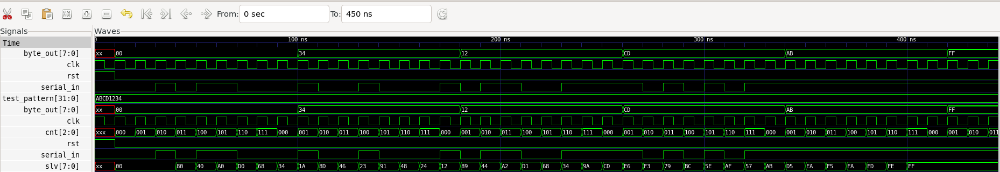
    <figcaption>Figure 6: QuestaSim compiled VHDL code but presented in Gtkwave </figcaption>
  </figure>

### Elaborated Schematic

  <figure>
    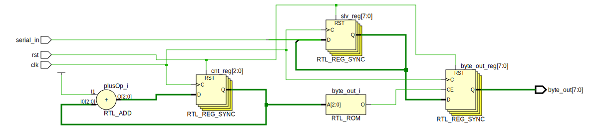
    <figcaption>Figure 7: QuestaSim compiled VHDL code but presented in Gtkwave </figcaption>
  </figure>

Notice the exact correspondence with the [SV](#elaborated-schematics) produced by Vivado even though their wave diagrams are a bit different. 

### Synthesized Schematic

And the same correspondence is seen in both for VHDL and [SV](#synthesized-schematic), expectedly so. 

  <figure>
    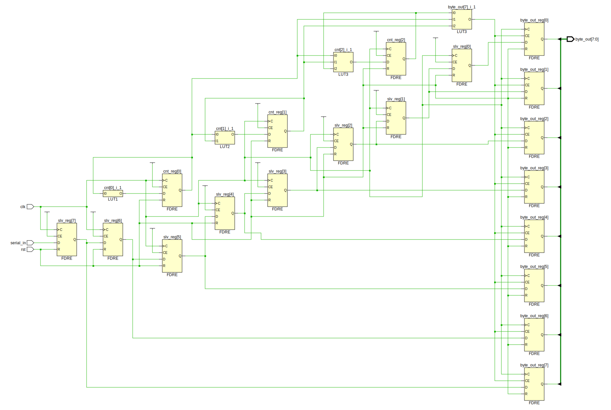
    <figcaption>Figure 8: The synthesized schematic generated by Vivado for shift register architecture using VHDL </figcaption>
  </figure>

# Multiplexer (mux)

Rather than shift register version the multiplexer architecture is used and compared. 

## SystemVerilog

### Simulation Wave Diagrams

<table>
  <tr>
    <td align="center">
       
      <small>Figure 9: Verilator wave diagram output in Gtkwave done in SV</small>
    </td>
  </tr>
  <tr>
    <td align="center">
      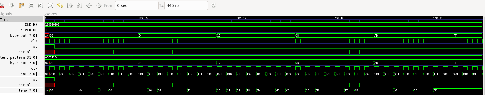 
      <small>Figure 10: QuestaSim compiled output shown in Gtkwave done in SV</small>
    </td>
  </tr>
</table>

### Elaborated Schematics

#### Yosys

Same ports as [shift register](#yosys) but the underling architecture is different. 

  <figure>
    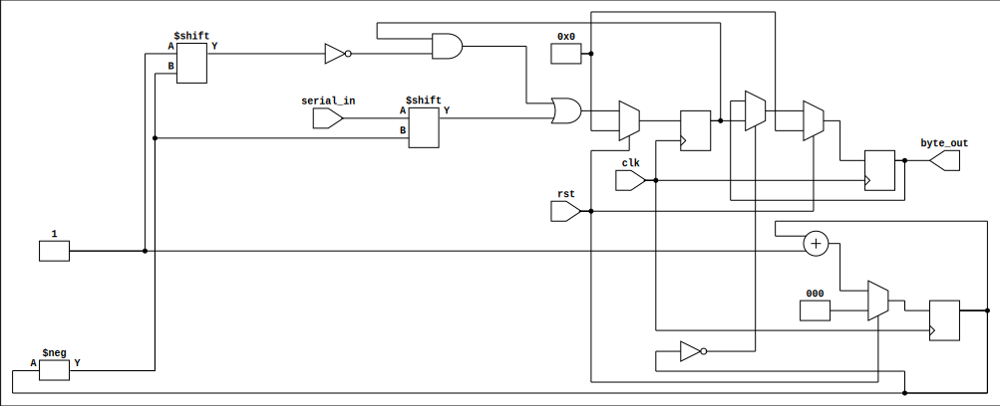
    <figcaption>Figure 11: The elaborated Yosys schematic for multiplexer architecture </figcaption>
  </figure>

#### Vivado

As compared to [shift register](#vivado) this one has more components. 

  <figure>
    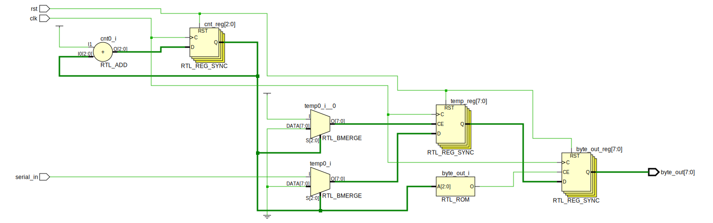
    <figcaption>Figure 12: The elaborated Vivado schematic for multiplexer architecture </figcaption>
  </figure>

### Synthesized Schematic

The synthesized schematic is quite different than for [shift register](#synthesized-schematic). Since this is a multiplexer implementation, the critical path needs to be taken into consideration. Otherwise the longest path can limit performance. 

  <figure>
    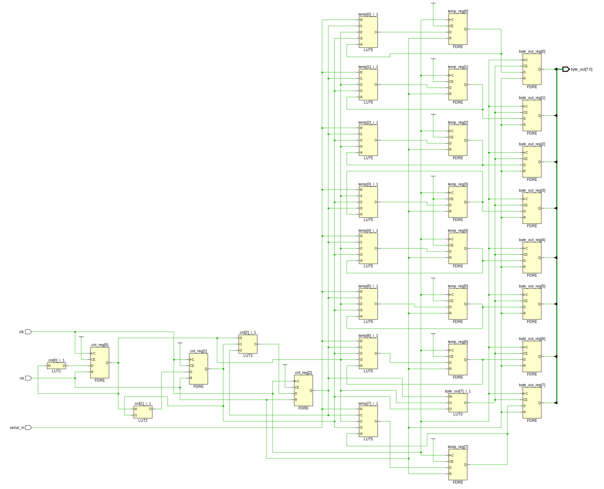
    <figcaption>Figure 13: The elaborated Vivado schematic for multiplexer architecture </figcaption>
  </figure>

## VHDL

### Simulation Wave Diagram

Similar to [Figure 10](#simulation-wave-diagrams-1) but there is a slight mismatch in time at the beginning. 

  <figure>
    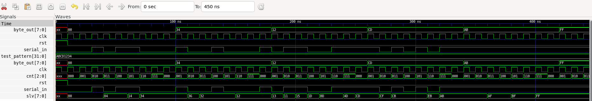
    <figcaption>Figure 14: QuestaSim compiled VHDL code but presented in Gtkwave </figcaption>
  </figure>

### Elaborated Schematic

The exact same schematic is also shown in [SV mux](#elaborated-schematics-1). 

  <figure>
    
    <figcaption>Figure 15: The elaborated Vivado schematic for multiplexer architecture </figcaption>
  </figure>

### Synthesized Schematic

Unsurprisingly, the exact same schematic is generated here as for [SV](#synthesized-schematic-2). 

  <figure>
    
    <figcaption>Figure 16: The elaborated Vivado schematic for multiplexer architecture </figcaption>
  </figure>

